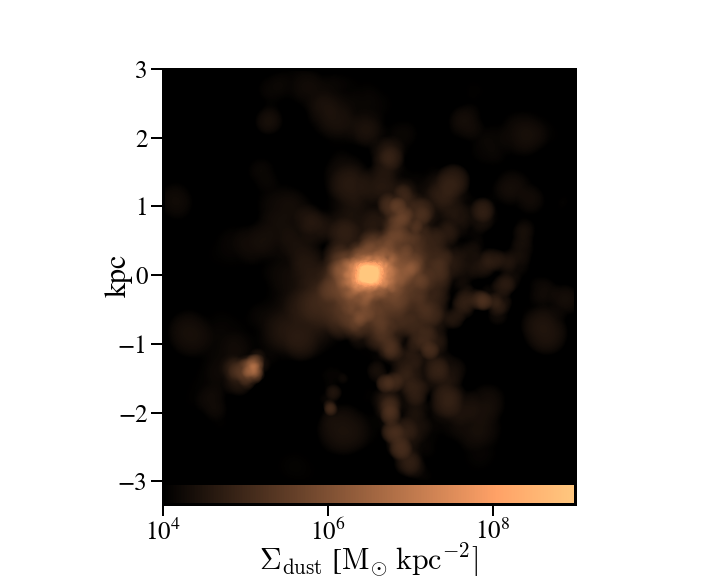

Analysis Procedures
********************
.. contents:: Section Contents
    :local:

Generating SFHs from Snapshots
===============================

(so far) There's two ways of calculating the star formation rate for simba galaxies which differ by the timescales the SFR is averaged over. The SFR calculated by caesar for galaxies is based on the current rate of star formation of the gas particles. This is an instantaneous measure of SFR -- literally, how many stars are being produced from gas particles at the moment the snapshot is written. A more general way to quantify the SFR is by averaging the stellar mass produced over some time period. This is more akin to the SFR that observers measure from galaxies, either by relating emission line luminosities to the SFR or by modeling galaxy SEDs with a SFH. Caesar does not currently calculate this SFR for us so I've written a script to do just that. 

The basic idea of the script is to take all the star particles for a particular object (i.e., galaxy) and bin them up according to their formation time and initial mass. While the formation time is an attribute of the star particle that is written upon its creation, the initial mass is not recorded. Thus, we need to use FSPS to estimate the initial mass based on the star's current mass, metallicity, and age using isochrone/evolution tracks. 

The output of this script is an object containing the formation times and initial masses of each star particle in the galaxy/galaxies of interest. To turn this into a SFH, I use a binning function from scipy that returns the SFR in arbitrary spaced bins; this allows us to make SFHs/calculate the recent SFR over whatever timescales we want. 

SFH Script
--------------

The script I use for generating SFHs for simba (or any cosmo sim), using FSPS to calculate the initial star particle masses, can be found at this link::
  
  https://github.com/smlower/sl_simulation_tools/blob/main/caesar_sfh.py

Which is just a repo where I keep generally useful scripts for dealing with simulations. The current setup for the script is for it to calculate the SFHs for all galaxies in the simba m25n512 z~5 snapshot. Lines 50-52 are where I make the list of galaxies I want SFHs for. The script can be edited to accept, e.g., command line arguments for snapshot, galaxy number, etc. 

The output is a pickled object containing a list of galaxy IDs and those galaxies' initial star particle masses and formation times. One thing to note is that FSPS takes some time to start up...once the isochrone grids are sampled, the initial mass interpolation speeds up siginificantly. 

Binning and plotting the SFH
-----------------------------

The list output from the above script is not immediately useful, as we need to bin those masses according to their formation times to get the SFH. This can be done tons of ways but the easiest (at least to me) way is using the scipy binned_statistic function. The code is (thankfully) documented a bit so it should be straightfoward::

  https://github.com/smlower/sl_simulation_tools/blob/main/bin_sfh.py

The good thing about binning this way is that we don't have to re-run FSPS everytime we want a differently sampled SFH -- just choose a different bin size!

Projection Plots with SPHViewer
=================================
One of the primary drawbacks to using yt is it's limited ability to plot particle datasets -- e.g., the star and dust particles that aren't acted upon by hydrodynamics and so don't have a smoothing length. Yt has a few work arounds for this issue but they remain a bit clunky. My preferred solution is to make projection plots with `sphviewer <https://github.com/alejandrobll/py-sphviewer>`_. This software is really flexible and has created some beautiul images (see, e.g., `Lovell+2021 <https://ui.adsabs.harvard.edu/abs/2021MNRAS.502..772L/abstract>`_ and `Lower+2023 <https://ui.adsabs.harvard.edu/abs/2022arXiv221202636L/abstract>`_). 

Below is a handy script that generates a projection plot of the dust particles in a particular galaxy but note the code can be edited to accept any particle type or field that's in the snapshot (e.g., temperatures, SFRs, etc.)::

   import sphviewer as sph                                                                                                                                                                       
   import numpy as np                                                                                                                                                                              
   import yt, caesar                                                                                                                                                                              
   import matplotlib.pyplot as plt                                                                                                                                                                   
   import matplotlib.colors as colors                                                                                                                                                                
   import matplotlib.cm as cm    
   import matplotlib
   matplotlib.rcParams.update({
    "savefig.facecolor": "w",
    "figure.facecolor" : 'w',
    "figure.figsize" : (10,8),
    "text.color": "k",
    "legend.fontsize" : 20,
    "font.size" : 30,
    "axes.edgecolor": "k",
    "axes.labelcolor": "k",
    "axes.linewidth": 3,
    "xtick.color": "k",
    "ytick.color": "k",
    "xtick.labelsize" : 25,
    "ytick.labelsize" : 25,
    "ytick.major.size" : 12,
    "xtick.major.size" : 12,
    "ytick.major.width" : 2,
    "xtick.major.width" : 2,
    "font.family": 'STIXGeneral',
    "mathtext.fontset" : "cm"}) 
    
   #load your data                                                                                                                                                                                        
   ds = yt.load(path+f'/snapshot_{snap:03d}.hdf5')                                                                                                                                                        
   obj = caesar.load(path+f'/Groups/caesar_snapshot_{snap:03d}.hdf5')                                                                                                                                     
   ad = ds.all_data()                                                                                                                                                                                     
   
   #i want to plot the dust mass surface densities for the most massive halo in the current snapshot, so:                                                                                                 
   dust_pos = ad['PartType0', 'Coordinates'][obj.halos[0].glist].in_units('kpc').value                                                                                                                    
   #note we have to do some clunky unit declaration first because the simba dust masses are indeed in code_mass but yt doesn't know that                                                                  
   dust_mass = ds.arr(ad['PartType0', 'Dust_Masses'][obj.halos[0].glist], 'code_mass').in_units('Msun').value                                                                                             
   hcoord = obj.halos[0].minpotpos.in_units('kpc').value                                                                                                                                                  
   
   extent=3 #this is like the 'width' parameter in yt projection plots                                                                                                                                    
   #this attempts to set the viewing angle with respect to the rotation axis of the galaxy disk                                                                                                         
   #but can be messed up for galaxies that are not quite disky yet                                                                                                                                        
   L = obj.galaxies[0].rotation['gas_L']                                                                                                                                                                  
   x_vec = [1, 0, 0]                                                                                                                                                                                      
   y_vec = [0,1,0]                                                                                                                                                                                        
   cos_theta = np.dot(L, x_vec) / (np.sqrt(np.dot(x_vec, x_vec)) * np.sqrt(np.dot(L, L)))                                                                                                                 
   cos_phi = np.dot(L, y_vec) / (np.sqrt(np.dot(y_vec, y_vec)) * np.sqrt(np.dot(L, L)))                                                                                                                   
   t = np.rad2deg(np.arccos(cos_theta)) #the meaning of these params is defined later                                                                                                                     
   p = np.rad2deg(np.arccos(cos_phi))                                                                                                                                                                     
   
   #first, we tell sphviewer where our particles are                                                                                                                                                      
   P = sph.Particles(dust_pos*0.68, dust_mass*0.68) #factors of little h float everywhere :(                                                                                                              
   #second, sphviewer sets up a camera object, using the above viewing angle params                                                                                                                       
   #t = theta, p = phi, and are defined in spherical coordinates (i think) w.r.t the simulation box                                                                                                       
   #r is the radial distance from the center at (x,y,z) = hcoord.                                                                                                                           
   C = sph.Camera(x=hcoord[0]*0.68, y=hcoord[1]*0.68, z=hcoord[2]*0.68,r='infinity',t=t, p=p, roll=0, extent=[-extent,extent,-extent,extent],xsize=400, ysize=400)                                          
   #and these two actually generate the image array                                                                                                                                                       
   S = sph.Scene(P, Camera=C)                                                                                                                                                                             
   R = sph.Render(S)                                                                                                                                                                                      
   img_dust = R.get_image()                                                                                                                                                                               
   
   #and plot                                                                                                                                                                                              
   vmin, vmax = 1e4, 1e9 #some educated guess as to 'good' array limits to get nice contrast in the plot                                                                                                  
   cNorm  = colors.LogNorm(vmin=vmin,vmax=vmax)                                                                                                                                                           
   time = obj.simulation.time.in_units('Myr')                                                                                                                                                             
   sm1 = ax1.imshow(img_dust, extent=[-extent,extent,-extent,extent],cmap=cm.copper, norm=cNorm)                                                                                                         
   ax1.set_xticklabels([])                                                                                                                                                                                
   divider = make_axes_locatable(ax1)                                                                                                                                                                  
   cax = divider.append_axes("bottom", size="5%", pad=0.03)
   cbar = fig.colorbar(sm1, cax=cax, orientation='horizontal')
   cbar.ax.set_xlabel(f'$\Sigma_\mathrm{dust}$ '+'[$\mathrm{M_{\odot} \; kpc^{-2}}]$',labelpad=-5)
   ax1.set_ylabel('kpc',labelpad=-15)
   ax1.annotate(f't = {time:.2f}',(-4,4),color='white',fontsize=20)                                                                                                                                     

And the resulting plot for a random high-z galaxy:

