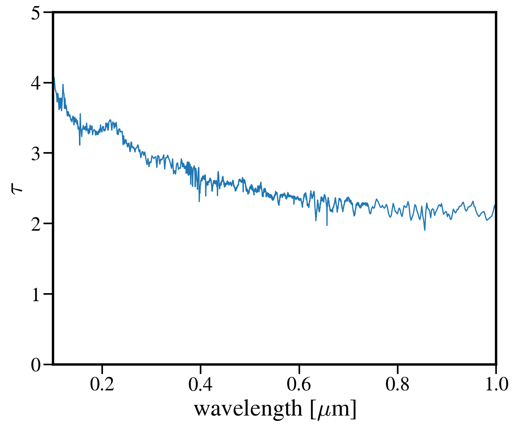
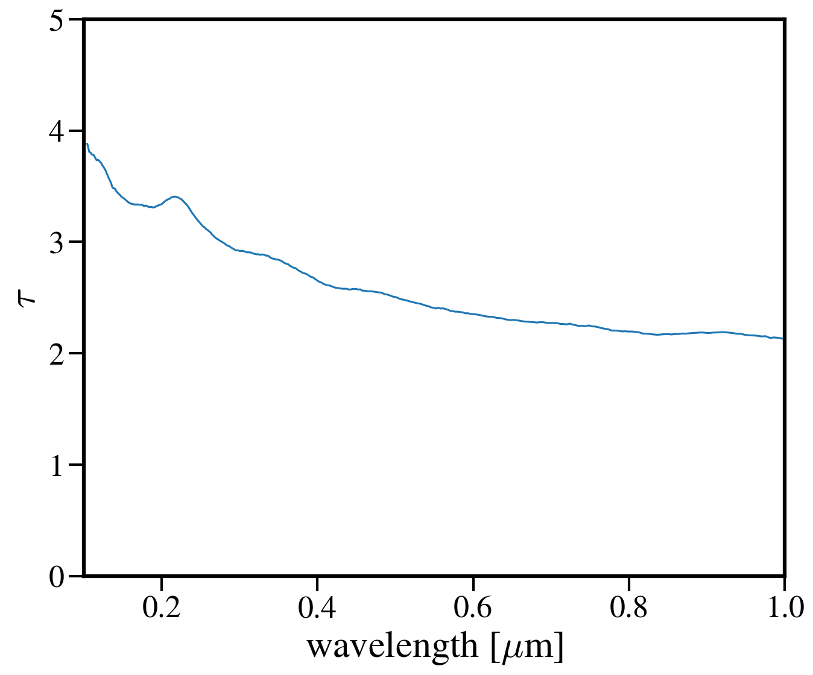
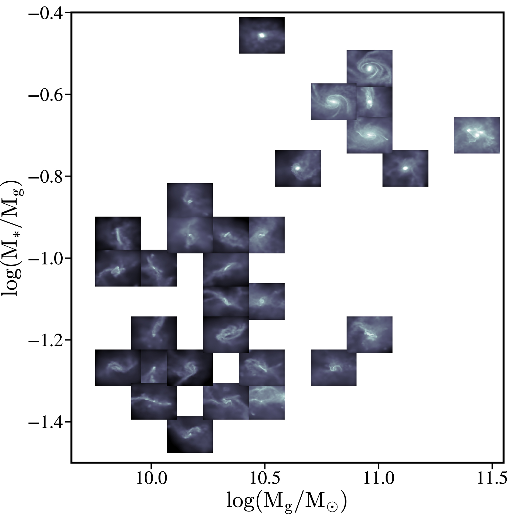
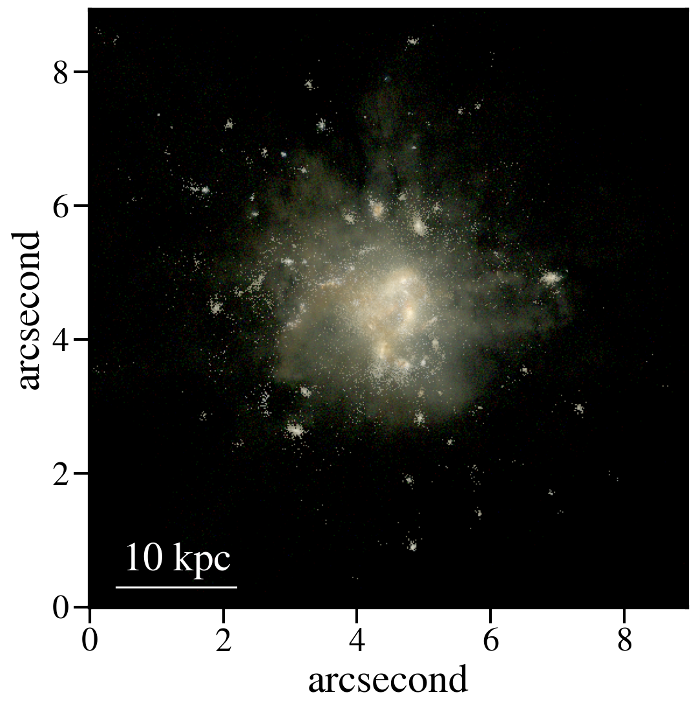
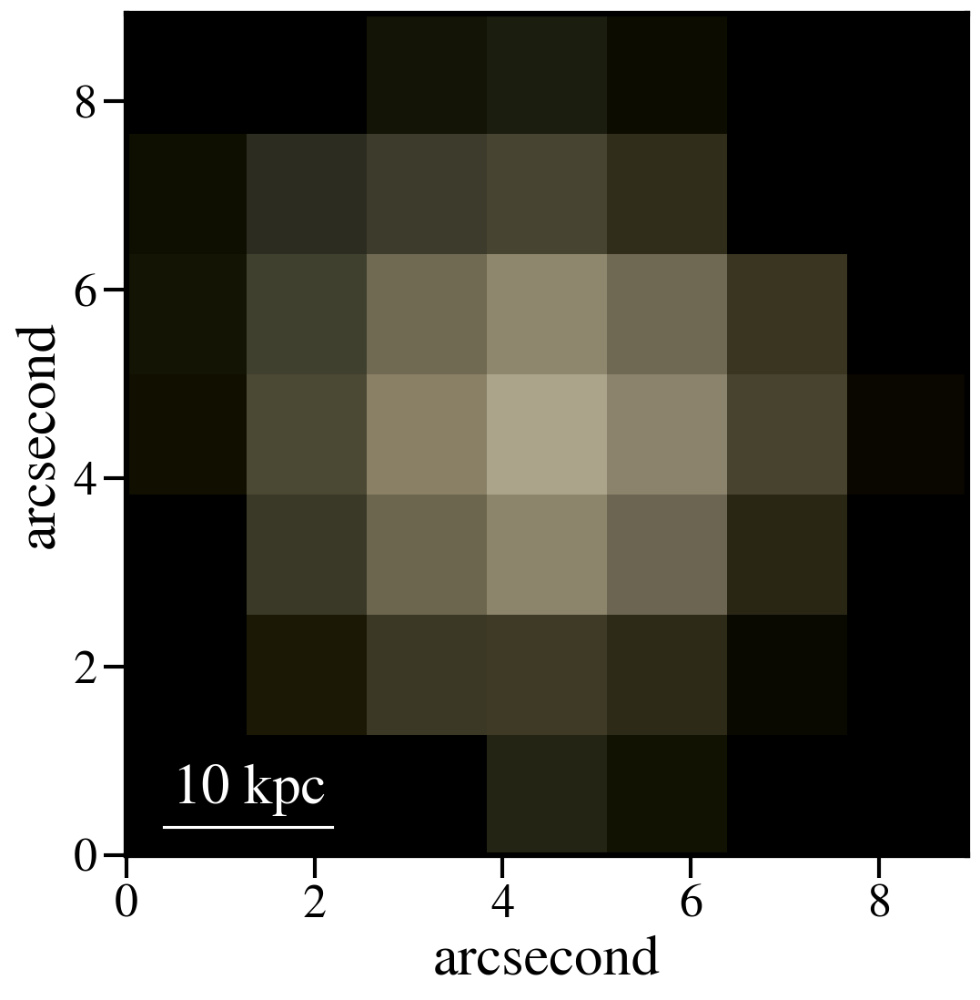

Analysis Procedures
********************

Trying to collect useful methods (getting SFHs, attenuation curves) and plotting tools. 

.. contents:: Section Contents
    :local:

Generating SFHs from Snapshots
===============================

(so far) There's two ways of calculating the star formation rate for simba galaxies which differ by the timescales the SFR is averaged over. The SFR calculated by caesar for galaxies is based on the current rate of star formation of the gas particles. This is an instantaneous measure of SFR -- literally, how many stars are being produced from gas particles at the moment the snapshot is written. A more general way to quantify the SFR is by averaging the stellar mass produced over some time period. This is more akin to the SFR that observers measure from galaxies, either by relating emission line luminosities to the SFR or by modeling galaxy SEDs with a SFH. Caesar does not currently calculate this SFR for us so I've written a script to do just that. 

The basic idea of the script is to take all the star particles for a particular object (i.e., galaxy) and bin them up according to their formation time and initial mass. While the formation time is an attribute of the star particle that is written upon its creation, the initial mass is not recorded. Thus, we need to use FSPS to estimate the initial mass based on the star's current mass, metallicity, and age using isochrone/evolution tracks. 

The output of this script is an object containing the formation times and initial masses of each star particle in the galaxy/galaxies of interest. To turn this into a SFH, I use a binning function from scipy that returns the SFR in arbitrary spaced bins; this allows us to make SFHs/calculate the recent SFR over whatever timescales we want. 

SFH Script
--------------

The script I use for generating SFHs for simba (or any cosmo sim), using FSPS to calculate the initial star particle masses, can be found at this link::
  
  https://github.com/smlower/sl_simulation_tools/blob/main/caesar_sfh.py

Which is just a repo where I keep generally useful scripts for dealing with simulations. The current setup for the script is for it to calculate the SFHs for all galaxies in the simba m25n512 z~5 snapshot. Lines 50-52 are where I make the list of galaxies I want SFHs for. The script can be edited to accept, e.g., command line arguments for snapshot, galaxy number, etc. 

The output is a pickled object containing a list of galaxy IDs and those galaxies' initial star particle masses and formation times. One thing to note is that FSPS takes some time to start up...once the isochrone grids are sampled, the initial mass interpolation speeds up siginificantly. 

Binning and plotting the SFH
-----------------------------

The list output from the above script is not immediately useful, as we need to bin those masses according to their formation times to get the SFH. This can be done tons of ways but the easiest (at least to me) way is using the scipy binned_statistic function. The code is (thankfully) documented a bit so it should be straightfoward::

  https://github.com/smlower/sl_simulation_tools/blob/main/bin_sfh.py

The good thing about binning this way is that we don't have to re-run FSPS everytime we want a differently sampled SFH -- just choose a different bin size!

Powderday Attenuation Curves
===============================

To calculate the attenuation curve for a galaxy, we need to generate an SED with powderday. Assuming you've already done that, here's how to get the attenuation curve::

  from hyperion.model import ModelOutput
  import astropy.constants as constants
  from hyperion.model import Model
  import astropy.units as u
  from tqdm.auto import tqdm

  #test on a high-z Cosmic Sands galaxy
  m_out = ModelOutput('/orange/narayanan/s.lower/simba/m25n256_dm/zooms/pd_runs/run9_halo0/snap24/run9_snap024.rtout.sed')
  wav, lum = m.get_sed(aperture=-1, inclination=0)
  wave, lum = wav[::-1], lum[::-1]

  #now, make a clean model with only the stellar sources
  m_sources = Model()
  #load source info with the rtin.sed powderday file
  m_sources.use_sources('/orange/narayanan/s.lower/simba/m25n256_dm/zooms/pd_runs/run9_halo0/snap24/run9_snap024.rtin.sed')
  
  #run through each source and get its spectrum
  #this is ripped from hyperion's get_spectrum routine
  nsources = len(m_sources.sources)
  fnu = []
  for i in tqdm(range(nsources)):
     nu = m_sources.sources[i].spectrum["nu"]
     tempfnu = m_sources.sources[i].spectrum["fnu"]  
     norm = integrate_loglog(nu, tempfnu)
     fnu.append(tempfnu / norm * np.sum(m_sources.sources[i].luminosity))

Two things here: 1. hyperion outputs wavelength and luminosity arrays in order of *decreasing* wavelength for some reason and 2. the composite SED is at a lower wavelength resolution than the source SEDs so we want to downsample the stellar SEDs::

  stellar_lum = nu*np.sum(fnu, axis=0)
  stellar_lum = stellar_lum[::-1]
  
  stellar_wave = (constants.c / (nu*u.Hz)).to(u.micron).value
  stellar_wave = stellar_wave[::-1]
  interp_lum = np.interp(wave, stellar_wave, stellar_lum)
  
  #lets compare SEDs.
  plt.loglog(wave, lum, label='Powederday SED')
  plt.loglog(wave, interp_lum, label='Intrinsic Stellar SED')
  
  plt.xlim([0.1, 1000])
  plt.ylim([1e42, 1e46])
  
  plt.ylabel('Luminosity [erg/s]')
  plt.xlabel('Wavelength [$\mu$m]')

 
.. image:: images/attenuation_seds.png
           :width: 600

And to get the attenuation curve::

  extinction = lum / interp_lum
  tau = -1.0 * np.log(extinction)

  plt.plot(wave, tau)
  plt.xlim([0.1, 1])
  plt.ylim([0, 5])
  plt.ylabel('$\\tau')
  plt.xlabel('wavelength [$\mu$m]')

You'll notice that the attenuation curve is pretty choppy - most of this is caused by numerics, since the SEDs were run at ~low resolution. To fix this, we can smooth the curve out without erasing the real features (like the UV bump at 2175 A).::

  from scipy.signal import savgol_filter
  smoothed_tau = savgol_filter(tau, 49, 3)

  

Projection Plots with SPHViewer
=================================
One of the primary drawbacks to using yt is it's limited ability to plot particle datasets -- e.g., the star and dust particles that aren't acted upon by hydrodynamics and so don't have a smoothing length. Yt has a few work arounds for this issue but they remain a bit clunky. My preferred solution is to make projection plots with `sphviewer <https://github.com/alejandrobll/py-sphviewer>`_. This software is really flexible and has created some beautiul images (see, e.g., `Lovell+2021 <https://ui.adsabs.harvard.edu/abs/2021MNRAS.502..772L/abstract>`_ and `Lower+2023 <https://ui.adsabs.harvard.edu/abs/2022arXiv221202636L/abstract>`_). 

Below is a handy script that generates a projection plot of the dust particles in a particular galaxy but note the code can be edited to accept any particle type or field that's in the snapshot (e.g., temperatures, SFRs, etc.)::

   import sphviewer as sph                                                                                                                                                                       
   import numpy as np                                                                                                                                                                              
   import yt, caesar                                                                                                                                                                              
   import matplotlib.pyplot as plt                                                                                                                                                                   
   import matplotlib.colors as colors                                                                                                                                                                
   import matplotlib.cm as cm    
   import matplotlib
   matplotlib.rcParams.update({
    "savefig.facecolor": "w",
    "figure.facecolor" : 'w',
    "figure.figsize" : (10,8),
    "text.color": "k",
    "legend.fontsize" : 20,
    "font.size" : 30,
    "axes.edgecolor": "k",
    "axes.labelcolor": "k",
    "axes.linewidth": 3,
    "xtick.color": "k",
    "ytick.color": "k",
    "xtick.labelsize" : 25,
    "ytick.labelsize" : 25,
    "ytick.major.size" : 12,
    "xtick.major.size" : 12,
    "ytick.major.width" : 2,
    "xtick.major.width" : 2,
    "font.family": 'STIXGeneral',
    "mathtext.fontset" : "cm"}) 
    
   #load your data                                                                                                                                                                                        
   ds = yt.load(path+f'/snapshot_{snap:03d}.hdf5')                                                                                                                                                        
   obj = caesar.load(path+f'/Groups/caesar_snapshot_{snap:03d}.hdf5')                                                                                                                                     
   ad = ds.all_data()                                                                                                                                                                                     
   
   #i want to plot the dust mass surface densities for the most massive halo in the current snapshot, so:                                                                                                 
   dust_pos = ad['PartType0', 'Coordinates'][obj.halos[0].glist].in_units('kpc').value                                                                                                                    
   #note we have to do some clunky unit declaration first because the simba dust masses are indeed in code_mass but yt doesn't know that                                                                  
   dust_mass = ds.arr(ad['PartType0', 'Dust_Masses'][obj.halos[0].glist], 'code_mass').in_units('Msun').value                                                                                             
   hcoord = obj.halos[0].minpotpos.in_units('kpc').value                                                                                                                                                  
   
   extent=3 #this is like the 'width' parameter in yt projection plots                                                                                                                                    
   #this attempts to set the viewing angle with respect to the rotation axis of the galaxy disk                                                                                                         
   #but can be messed up for galaxies that are not quite disky yet                                                                                                                                        
   L = obj.galaxies[0].rotation['gas_L']                                                                                                                                                                  
   x_vec = [1, 0, 0]                                                                                                                                                                                      
   y_vec = [0,1,0]                                                                                                                                                                                        
   cos_theta = np.dot(L, x_vec) / (np.sqrt(np.dot(x_vec, x_vec)) * np.sqrt(np.dot(L, L)))                                                                                                                 
   cos_phi = np.dot(L, y_vec) / (np.sqrt(np.dot(y_vec, y_vec)) * np.sqrt(np.dot(L, L)))                                                                                                                   
   t = np.rad2deg(np.arccos(cos_theta)) #the meaning of these params is defined later                                                                                                                     
   p = np.rad2deg(np.arccos(cos_phi))                                                                                                                                                                     
   
   #first, we tell sphviewer where our particles are                                                                                                                                                      
   P = sph.Particles(dust_pos*0.68, dust_mass*0.68) #factors of little h float everywhere :(                                                                                                              
   #second, sphviewer sets up a camera object, using the above viewing angle params                                                                                                                       
   #t = theta, p = phi, and are defined in spherical coordinates (i think) w.r.t the simulation box                                                                                                       
   #r is the radial distance from the center at (x,y,z) = hcoord.                                                                                                                           
   C = sph.Camera(x=hcoord[0]*0.68, y=hcoord[1]*0.68, z=hcoord[2]*0.68,r='infinity',t=t, p=p, roll=0, extent=[-extent,extent,-extent,extent],xsize=400, ysize=400)                                          
   #and these two actually generate the image array                                                                                                                                                       
   S = sph.Scene(P, Camera=C)                                                                                                                                                                             
   R = sph.Render(S)                                                                                                                                                                                      
   img_dust = R.get_image()                                                                                                                                                                               
   
   #and plot                                                                                                                                                                                              
   vmin, vmax = 1e4, 1e9 #some educated guess as to 'good' array limits to get nice contrast in the plot                                                                                                  
   cNorm  = colors.LogNorm(vmin=vmin,vmax=vmax)                                                                                                                                                           
   time = obj.simulation.time.in_units('Myr')                                                                                                                                                             
   sm1 = ax1.imshow(img_dust, extent=[-extent,extent,-extent,extent],cmap=cm.copper, norm=cNorm)                                                                                                         
   ax1.set_xticklabels([])                                                                                                                                                                                
   divider = make_axes_locatable(ax1)                                                                                                                                                                  
   cax = divider.append_axes("bottom", size="5%", pad=0.03)
   cbar = fig.colorbar(sm1, cax=cax, orientation='horizontal')
   cbar.ax.set_xlabel(f'$\Sigma_\mathrm{dust}$ '+'[$\mathrm{M_{\odot} \; kpc^{-2}}]$',labelpad=-5)
   ax1.set_ylabel('kpc',labelpad=-15)
   ax1.annotate(f't = {time:.2f}',(-4,4),color='white',fontsize=20)                                                                                                                                     

And the resulting plot for a random high-z galaxy:

.. image:: images/sphviewer_ex.png
           :width: 600

Thumbnails scatter plot a la Lower+2023, Cleri+2022
===============================

A cool use case for the surface density plots generated by sphviewer is to use them to represent galaxies on a scatter plot, if there is some relation between the galaxy morphologies / surface densities and other properties (for instance, Figure 4 of Lower et al. 2023a). Below is the code to achieve this plot::

  #assuming sphviewer figures are saved as fig.savefig(f'/blue/narayanan/s.lower/gas_disk{run}.png', bbox_inches='tight')
  from matplotlib.offsetbox import OffsetImage, AnnotationBbox

  def imscatter(x, y, image, ax=None, zoom=1):
     if ax is None:
        ax = plt.gca()
     try:
        image = plt.imread(image)
     except TypeError:
        # Likely already an array...
        pass
     im = OffsetImage(image, zoom=zoom)
     x, y = np.atleast_1d(x, y)
     artists = []
     for x0, y0 in zip(x, y):
        ab = AnnotationBbox(im, (x0, y0), xycoords='data', frameon=False)
        artists.append(ax.add_artist(ab))
     ax.update_datalim(np.column_stack([x, y]))
     ax.autoscale()
     return artists

     #in this plot we'll be showing the relation between gaseous disk formation and galaxy mass, so we want to collect stellar mass and gas mass for each galaxy
     path = 'path/to/simulations
     gmass, smass = [],[]
     for run in range(32):
         obj = caesar.load(path+f'/Groups/caesar_snapshot_{snap:03d}.hdf5')
	 gmass.append(obj.galaxies[0].masses['HI'].in_units('Msun') + obj.galaxies[0].masses['H2'].in_units('Msun'))
	 smass.append(obj.galaxies[0].masses['stellar'].in_units('Msun'))
	 

     #now to plot
     fig, ax = plt.subplots(1,1, figsize=(12, 12), tight_layout=True)
     grid_gas = np.linspace(8.5, 11.4, 22)
     grid_star_gas = np.linspace(np.log10(1e-2), np.log10(0.35), 22)
     ids = []
     

     #the basic idea is to make a grid of positions in M*/Mg vs Mg space (the quantities we're plotting)
     #we need to set up a grid instead of just using the actual quantities to avoid too much overlapping between the sphviewer images
     for i in range(32):
         x = gmass[i]
	 y = np.log10(smass[i] / gmass[i])
	 #here is where we find the grid locations closest to the actual galaxy mass
	 gas_pos = find_nearest(np.log10(x), grid_gas)
	 sg_pos = find_nearest(np.log10(smass[i] / gmass[i]), grid_star_gas)
	 lst = [gas_pos, sg_pos]
	 print(f'begin: {lst}')
	 combos = [[gas_pos-1, sg_pos], [gas_pos+1, sg_pos], [gas_pos, sg_pos-1], [gas_pos, sg_pos+1],
             [gas_pos+1, sg_pos+1], [gas_pos-1, sg_pos-1], [gas_pos-1, sg_pos+1], [gas_pos+1, sg_pos-1],
             [gas_pos+2, sg_pos], [gas_pos-2, sg_pos]]
	 if lst in ids:
	     combo_select = 0
	     #if the best grid position is already taken by a previous galaxy, try and jitter around that grid position to find a spot that isn't taken
	     #we go as far as 2 grid spaces away to try and find an empty spot...the idea is to balance accuracy in mass representation on the plot with the degree of overlap
	     #of the image thumbnails
             while lst in ids:
                 print(f'{lst} taken, finding new pos')
		 lst = combos[combo_select]
		 combo_select += 1
        
    ids.append(lst)
    #then we plot using the above function, which i ripped from somewhere in stack overflow
    #the zoom parameter controls the size of the images...this in conjunction with the grid construction and the jittering can be tuned to get the best result in terms of 
    #accuracy and visibility
    imscatter(grid_gas[lst[0]], grid_star_gas[lst[1]], f'/blue/narayanan/s.lower/gas_disk{i}.png', ax=ax, zoom=0.12)
    ax.set_ylim([-1.55, -0.38])
    ax.set_xlim([9.75, 11.53])
    ax.tick_params(labelsize=29)

    ax.tick_params(axis='both', which='major', length=10, width=2)
    ax.set_ylabel('$\log(\mathrm{M}_\mathrm{*} / \mathrm{M}_\mathrm{g})$', fontsize=35)
    ax.set_xlabel('$\log(\mathrm{M}_\mathrm{gas} / \mathrm{M}_{\odot})$', fontsize=35)

     

Basic post processing of Powderday RGB Images
===============================

The images generated by Powderday are natively in the pixel scale set in the parameters_master file. To simulate observations, we can convolve these images with the pixel scale of whatever instrument we are trying to emulate. Below I show how to do this for JWST and Spitzer. 

First, I ran powderday imaging on a galaxy at three (rest-frame) wavelengths to make a composite RGB image: 0.35 (B), 0.5 (G), and 0.8 (R) microns. Below is code to open these images, adjust the distance/observed luminosity, and plot the combined image::

  from hyperion.model import ModelOutput
  import yt, h5py
  from astropy.visualization import simple_norm 
  yt_cosmo = yt.utilities.cosmology.Cosmology(hubble_constant=0.68, omega_lambda = 0.7, omega_matter = 0.3)
  nu = constants.c / (np.array([0.8, 0.55, 0.35])*u.micron)
  distance=float(yt_cosmo.luminosity_distance(0,6.5).in_units('cm').value)
  #pd filter convolved images
  hd_r = h5py.File('/orange/narayanan/s.lower/simba/m25n256_dm/zooms/pd_runs/imaging/run19_snap042/r/convolved.042.hdf5', 'r')
  convolved_image_r = np.array(hd_r['image_data'])[0,:,:] * 1e6 / (4 * np.pi * distance**2) / nu[0].to(u.Hz).value
  hd_r.close()

  hd_b = h5py.File('/orange/narayanan/s.lower/simba/m25n256_dm/zooms/pd_runs/imaging/run19_snap042/b/convolved.042.hdf5')
  convolved_image_b = np.array(hd_b['image_data'])[0,:,:]* 1e6 / (4 * np.pi * distance**2) / nu[2].to(u.Hz).value
  hd_b.close()

  hd_g = h5py.File('/orange/narayanan/s.lower/simba/m25n256_dm/zooms/pd_runs/imaging/run19_snap042/g/convolved.042.hdf5')
  convolved_image_g = np.array(hd_g['image_data'])[0,:,:]* 1e6 / (4 * np.pi * distance**2) / nu[1].to(u.Hz).value
  hd_g.close()

  #combined into a single RGB image
  vmin = -31.5
  vmax = -27
  
  R_img_log = np.log10(convolved_image_r)
  G_img_log = np.log10(convolved_image_g)
  B_img_log = np.log10(convolved_image_b)
  
  R_img_log[R_img_log<vmin] = vmin
  R_img_log[R_img_log>vmax] = vmax
  B_img_log[B_img_log<vmin] = vmin
  B_img_log[B_img_log>vmax] = vmax
  G_img_log[G_img_log<vmin] = vmin
  G_img_log[G_img_log>vmax] = vmax
  
  R_img_log = (R_img_log-vmin)/(vmax - vmin)
  G_img_log = (G_img_log-vmin)/(vmax - vmin)
  B_img_log = (B_img_log-vmin)/(vmax - vmin)
  image = (np.dstack((R_img_log, G_img_log, B_img_log)) * 255.999).astype(np.uint8)

  #and plot
  norm = simple_norm(image, 'power')
  angular_size = yt_cosmo.quan(yt_cosmo.quan(25., 'kpc')/yt_cosmo.angular_diameter_distance(0,6.55).in_units('kpc'), 'radian')
  plt.imshow(image, norm=norm,extent=[0,2*angular_size.in_units('arcsec').value,0,2*angular_size.in_units('arcsec').value ])
  plt.ylabel('arcsecond')
  plt.xlabel('arcsecond')
  angsize_5kpc = yt_cosmo.quan(yt_cosmo.quan(10., 'kpc')/yt_cosmo.angular_diameter_distance(0,6.55).in_units('kpc'), 'radian').in_units('arcsec')
  plt.plot([0.4, 0.4+angsize_5kpc.value], [0.3, 0.3], color='white',
        zorder=20)
  plt.annotate("10 kpc", xy=(0.5, 0.55), color='white')
  

Here is the resulting image:

So now let's pretend we observed this system with JWST. For this z=6.5 galaxy, restframe RGB falls into MIRI's 770W filter and NIRCam's 444W and 277W filters. We can "observe" this galaxy with JWST by convolving the images with each filter's psf and rescaling to JWST's pixel scale::

  from astropy.io import fits
  #JWST PSFs
  psf277_fits = '/orange/narayanan/s.lower/simba/m25n256_dm/zooms/pd_runs/imaging/run2_snap065/DIY_nircam277w_psf.fits'
  psf_277 = fits.open(psf277_fits)
  psf444_fits = '/orange/narayanan/s.lower/simba/m25n256_dm/zooms/pd_runs/imaging/run2_snap065/DIY_nircam444w_psf.fits'
  psf_444 = fits.open(psf444_fits)
  psf770_fits = '/orange/narayanan/s.lower/simba/m25n256_dm/zooms/pd_runs/imaging/run2_snap065/DIY_miri770w_psf.fits'
  psf_770 = fits.open(psf770_fits)
  miri_770w_psf = psf_770[0].data
  nircam_444w_psf = psf_444[0].data
  nircam_277w_psf = psf_277[0].data
  
  smoothed_data_r = convolve(convolved_image_r, miri_770w_psf[1:,1:])
  smoothed_data_g = convolve(convolved_image_g, nircam_444w_psf[1:,1:])
  smoothed_data_b = convolve(convolved_image_b, nircam_277w_psf[1:,1:])

  #JWST pixel scales
  jwst_nircam_pixel_scale = 0.031 # arcsec/ pixel
  jwst_miri_pixel_scale = 0.11 # arcsec/ pixel

Now because MIRI is lower res than NIRCam, we actually want to scale everything by the lowest resolution::

  #Powderday resolution
  angular_size = yt_cosmo.quan(yt_cosmo.quan(50., 'kpc')/yt_cosmo.angular_diameter_distance(0,6.5).in_units('kpc'), 'radian') #powderday image is 50 kpc across, 
  #but we wanna scale to z=6.5
  pd_pixel_scale = angular_size.in_units('arcsec').value / 512 #image is 512 pixel resolution
  
  #now rescale image
  from skimage.transform import rescale  
  
  new_size = int(pd_pixel_scale/jwst_miri_pixel_scale * np.shape(smoothed_data_g)[0])
  g_rescaled = rescale(smoothed_data_g, new_size/512, anti_aliasing=True)
  new_size = int(pd_pixel_scale/jwst_miri_pixel_scale * np.shape(smoothed_data_r)[0])
  r_rescaled = rescale(smoothed_data_r, new_size/512, anti_aliasing=True)
  new_size = int(pd_pixel_scale/jwst_miri_pixel_scale * np.shape(smoothed_data_b)[0])
  b_rescaled = rescale(smoothed_data_bb, new_size/512, anti_aliasing=True)

  #and combine
  vmin = -31.5                                                                                                                                                                        
  vmax = -27

  R_img_log = np.log10(r_rescaled)
  G_img_log = np.log10(g_rescaled)
  B_img_log = np.log10(b_rescaled)

  R_img_log[R_img_log<vmin] = vmin
  R_img_log[R_img_log>vmax] = vmax
  B_img_log[B_img_log<vmin] = vmin
  B_img_log[B_img_log>vmax] = vmax
  G_img_log[G_img_log<vmin] = vmin
  G_img_log[G_img_log>vmax] = vmax

  R_img_log = (R_img_log-vmin)/(vmax - vmin)
  G_img_log = (G_img_log-vmin)/(vmax - vmin)
  B_img_log = (B_img_log-vmin)/(vmax - vmin)
  image = (np.dstack((R_img_log, G_img_log, B_img_log)) * 255.999).astype(np.uint8)

  #and plot again
  norm = simple_norm(image, 'power')
  angular_size = yt_cosmo.quan(yt_cosmo.quan(25., 'kpc')/yt_cosmo.angular_diameter_distance(0,6.55).in_units('kpc'), 'radian')
  plt.imshow(image, norm=norm,extent=[0,2*angular_size.in_units('arcsec').value,0,2*angular_size.in_units('arcsec').value ])
  plt.ylabel('arcsecond')
  plt.xlabel('arcsecond')
  angsize_5kpc = yt_cosmo.quan(yt_cosmo.quan(10., 'kpc')/yt_cosmo.angular_diameter_distance(0,6.55).in_units('kpc'), 'radian').in_units('arcsec')
  plt.plot([0.4, 0.4+angsize_5kpc.value], [0.3, 0.3], color='white',zorder=20)
  plt.annotate("10 kpc", xy=(0.5, 0.55), color='white')

Which produces this image, which is less resolved than the native Powderday image:
  .. image:: images/pd_rgb_jwst_miri.png
           :width: 600

Or this, if we instead smoothed to NIRCam's pixel scale:

  .. image:: images/pd_rgb_jwst_nircam.png
           :width: 600

Finally, let's gain a greater appreciation for JWST's power by seeing what Spitzer would've seen::

  #IRAC PSF
  psf1 = fits.open('/orange/narayanan/s.lower/spitzer_psfs/IRAC1_col181_row233.fits')
  psf2 = fits.open('/orange/narayanan/s.lower/spitzer_psfs/IRAC2_col181_row233.fits')
  psf4 = fits.open('/orange/narayanan/s.lower/spitzer_psfs/IRAC4_col181_row233.fits')

  spitzer_pixel_scale = 1.22

  new_size = int(pd_pixel_scale/spitzer_pixel_scale * np.shape(smoothed_data_gauss_g)[0])
  g_rescaled = rescale(smoothed_data_gauss_g, new_size/512, anti_aliasing=True)
  new_size = int(pd_pixel_scale/spitzer_pixel_scale * np.shape(smoothed_data_gauss_r)[0])
  r_rescaled = rescale(smoothed_data_gauss_r, new_size/512, anti_aliasing=True)
  new_size = int(pd_pixel_scale/spitzer_pixel_scale * np.shape(smoothed_data_gauss_b)[0])
  b_rescaled = rescale(smoothed_data_gauss_b, new_size/512, anti_aliasing=True)

And combining as above:
  

Oof. 

  

  
  
