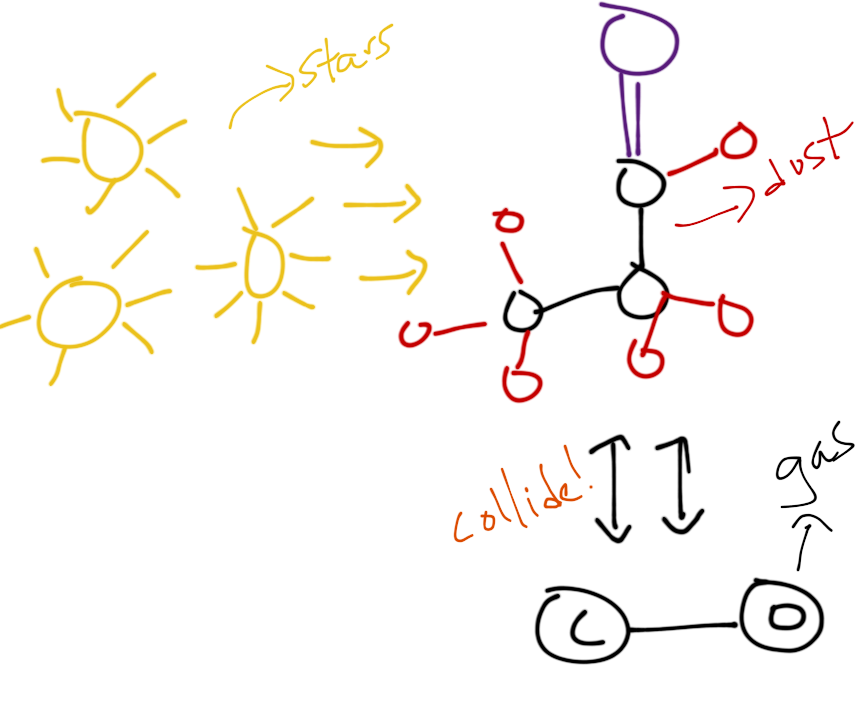

Documentation for Desika Narayanan's Astrophysics Group at the University of Florida
=====================================

Here you'll find documentation for different software and hardware, as
well as other useful information for interfacing with this research
group.  Some useful links to get you started:

Desika's website: https://users.astro.ufl.edu/~desika.narayanan/

Slack Group: https://desikasgroupofawesome.slack.com

HiPerGator resources: https://help.rc.ufl.edu/doc/Getting_Started

Caesar docs: https://caesar.readthedocs.org

powderday docs: https://powderday.readthedocs.org

SIMBA website: https://simba.roe.ac.uk

Contents:

.. toctree::
   :maxdepth: 2

   hipergator.rst
   code_installations.rst
   caesar.rst
   running_cosmological_simulations.rst
   slick.rst
   

Indices and tables
==================

* :ref:`genindex`
* :ref:`modindex`
* :ref:`search`

