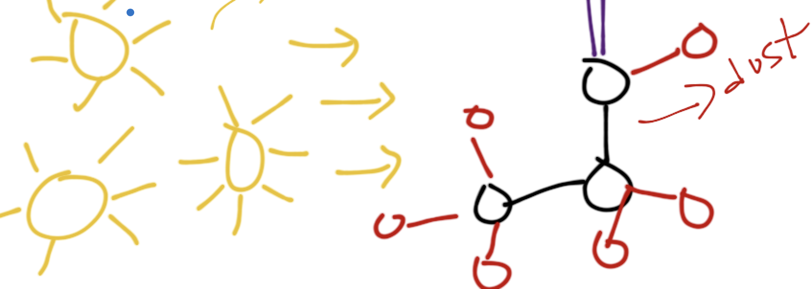

Documentation for Desika Narayanan's Astrophysics Group at the University of Florida
=====================================

   
Here you'll find documentation for different software and hardware, as well as other useful information for interfacing with this research
group.

.. important:: **Some helpful links**:

        * Slack Group: https://desikasgroupofawesome.slack.com

        * HiPerGator resources: https://help.rc.ufl.edu/doc/Getting_Started

        * Caesar docs: https://caesar.readthedocs.org

        * Powderday docs: https://powderday.readthedocs.org

        * SIMBA website: https://simba.roe.ac.uk

        * Hyperion docs: https://docs.hyperion-rt.org/en/stable/

.. toctree::
   :caption: Table of Contents:
   :numbered:
   :maxdepth: 2

   new_member_onboarding.rst
   intro_to_hpg.rst
   common_software_tools.rst
   code_installations.rst
   using_major_group_codes.rst
   running_galaxy_simulations.rst
   analyzing_galaxy_simulations.rst
   running_powderday_simulations.rst
   seds_with_prospector.rst
   analysis.rst
   camels_processing.rst

