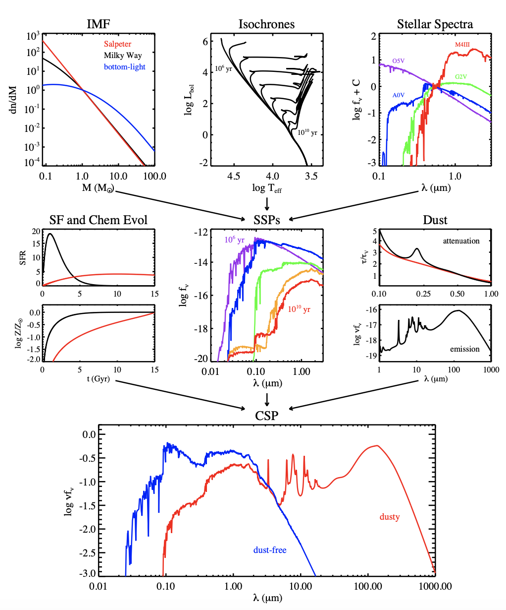

Intro to SED Fitting with Prospector
**************************************
A brief intro to SED modeling and using prospector. I cover two things in this tutorial: (1) basics of SED modeling that apply to any SED fitting code and (2) Bayesian inference (to the best of my ability). 

.. contents:: Section Contents
    :local:

A (decently written) tutorial is available on github that walks through the basics of installing propsector and its dependencies, setting up a prospector run, and doing some analysis with the output. You can find that repo, which contains a tutorial notebook and the needed data files, here::

  https://github.com/smlower/prospector_tutorial

IMPORTANT NOTE: As of Fall 2024, an important bug in these scripts has been identified. If you are attempting to run PROSPECTOR on any SED is that not supposed to be at z=0, there is a multiplicative (1+z) term in the calculation of the flux density before the integration into the photometric filters. You can see equation 6 in this paper (https://arxiv.org/pdf/astro-ph/0210394) and its explanation, but briefly, because the units need to be flux/frequency in the observed frame, you need the 1+z term in addition to the luminosity distance calculation. See also this issue (https://github.com/bd-j/prospector/issues/356#issuecomment-2491620167) for an example of how this can affect calculations. This fork created by Dhruv in Fall 2024 (https://github.com/DhruvZ/prospector_tutorial) has these lines incorporated.

Besides the tutorial on github, the installation instructions can also be found at::

  https://github.com/dnarayanan/desikasgroupofawesome/blob/main/using_major_group_codes.rst#prospector

Step 1: What is SED fitting?
============================

SED modeling basically entails mapping the observed light of a galaxy at different wavelengths to their physical properties like stellar mass, star formation rate, and dust mass. There's a bunch of different codes that do this with varying levels of sophistication: FAST, CIGALE, MAGPHYS, ProSpect, Prospector, BAGPIPES, and many, many more.

To model a galaxy spectrum and infer the galaxy's properties, there's a bunch of assumptions we have to make about how and when the stars formed in a galaxy (the star formation history), how much and what kind of dust is in that galaxy (dust attenuation and emisision), the properties of regions like HII nebulae and AGN. For the purposes of this tutorial, we're going to focus on just the components pertaining to stars and dust. Below is a great summary figure from Charlie Conroy's 2013 review article on the technique of modeling stellar populations. 

Modeling Stellar Populations
------------------------------
The top row concerns modeling stellar evolution. The IMF represents the stellar mass distribution of stars in a galaxy -- literally how many stars of each mass are born in a galaxy. There's a lot of debate over what the IMF is in various regions of our own Galaxy, let alone other galaxies, but for our purposes, we just assume one of the typical distributions from the literature like Kroupa 2002 or Chabrier 2003. 

The isochrones are models detailing how stars move about the HR diagram as a function of time. Each line in that plot represents the distribution of stars for a fixed time. Stars that are born at the same time, but of different masses, will occupy different regions in color-magnitude space, impacting the colors of a galaxy. 

The right-hand plot shows spectra for a few different spectral types. Combine these three ingredients and we get something called a simple stellar population, or SSP, shown in the middle panel of the middle row. A simple stellar population represents the spectrum of a group of stars that are the same age. Think of it as taking a picture of a globular cluster: those stars formed at ~the same time but are of different masses and so the combined spectrum of that cluster will depend on how many high/low mass (hot/cold temp) stars there are and the age of that cluster.

But a galaxy is definitely not just a globular cluster. It's more of a bunch of globular clusters of different ages put together. So how do we describe that spectrum? We combine it with a model for the star formation history of the galaxy -- literally, when did those globular clusters form? The left panel in the middle row shows two examples of a star formation history model (let's ignore the bottom plot showing metallicity). SFHs of real galaxies are diverse from galaxy-to-galaxy and have different short- and long-term variability. Convolving a model for SFH with an SSP gives us a compsite stellar spectrum combining the effects of stellar spectral types and stellar age. We can see an example of this spectrum in the blue curve plotted in the bottom row.

Dust Attenuation and Emission
-------------------------------
Finally, to the shagrin of most UV and optical astronomers, a galaxy is not just stars: it also contains dust. Dust modulates the spectrum of a galaxy by absorbing the UV and optical light of stars and re-emitting that light as a blackbody in the far-infrared. This absorption (+ scattering) is called dust attenuation and is modeled with a dust attenuation curve. In the right panel of the middle row, we see an example of this where tau (optical depth) is plotted as a function of wavelength. Dust preferentially absorbs light (i.e., higher optical depths) in the UV and not as much in the red / near-IR. There's several features to a dust attenuation curve but for now, we'll stick with using one of the most commonly used attenuation curves in the literature: the Calzetti 2001 curve, which is shown in red in the plot. The plot right underneath shows the resulting dust emission spectra. Focusing on the peak of the curve around 100 micron, this spectrum is the result of the dust absorbing light in the UV, heating up, and re-emitting that light as a thermal blackbody. The weird features around 10 micron are the result of a special kind of dust called PAHs (polycyclic aromatic hydrocarbon) -- these are fascinating but we'll ignore them for now. The shape of the blackbody curve is dependent on the amount of dust and the dust temperature.

Putting The Pieces Together
-----------------------------
Combining the two rows, we get a 'composite' galaxy spectra, including the contributions of stars of all ages and dust, shown in red in the bottom plot. This is the general shape of a galaxy SED: the stars dominate in the UV and optical while the dust emission dominates in the mid- to far-infrared. 

To extract information from a galaxy SED, we essentially do the above process backwards: what star and dust spectra are the best fit to the observed SED, from which we can derive the properties of the galaxy? To figure that out, we select models for the stellar evolution, star formation history, and dust. The stellar evolution models are typically fixed (i.e., we choose one model set and stick with it), but the parameters of the star formation history model and the dust attenuation/emission models can vary -- this represents the basis of our MCMC problem: what combination of model parameters give us a best fit to our data? To perform this fit, we'll use fsps+dynesty+prospector.

Step 2: How to fit data?
========================
The basic idea anytime we want to fit a model to data is to literally minimize the difference between the model and the data. In its most basic form, this means generating a model SED and calculating the chi square statistic, with the 'best fit' model having the lowest chi square. In a more sophisticated form, this involves Bayesian inference. I'm never going to do an explanaition of Bayesian statistics justice, so if you're super interested in learning the mechanics of this, I suggest doing outside readins. Regardless, the basis of Bayesian inference is that we have some 'prior' knowledge that we can use to construct the probability distribution of model parameters, which can in turn be used to construct a sort-of best fit model SED. Bayesian inference comes from Bayes theorem (which I'll point to the wiki page for more info: https://en.wikipedia.org/wiki/Bayes%27_theorem) which says the probability distribution of a model parameter (called the posterior distribution) is related to the likelihood of that model parameter * the prior distribution of that model parameter. If you've ever read a paper about model fitting or listened to a colloquium about deriving properties of something from a model, this is where 'prior,' 'posterior,' and 'likelihood' come from.

What this means in practice is that for any set of models we choose for our SED components (star formation history, dust), the model SED is evaluated based on the prior knowledge of the distribution of model parameters and the likelihood of that model parameter representing the true data. For our purposes, the likelihood function is taken care of in the internals of prospector/dynesty. Thus for each variable model parameter, we will choose a prior distribution based on our knowledge of that parameter. Literally, what are the physical or known values this model parameter can take? An example is the age of a galaxy: we know that a galaxy has to have an age greater than zero and less than the age of the universe. Now, priors can have any degree of complexity but most of the time we will use an 'uninformative' prior, i.e., a prior that does not impose a lot of weight on the posterior distribution of the model paramter. An example of an uninformative prior is a uniform distribution, and for the age of the galaxy, the prior would range from 0 to 14 Gyr with every value in between having equal probability within the prior space. An example of an 'informative' prior would be a Gaussian, where galaxy ages around the mean of the Gaussian would have greater weight than ages close to the wings. Neither prior distribution is necessarily 'wrong,' (and believe me, there's tons of discussion on the intricacies of choosing priors) and generally is entirely dependent on the information/data we have and the problem we are trying to solve.

Specifically for prospector, which we'll see below, we don't interface with the actual Bayesian inference at all, besides the initial selection of models and the choices for model priors. After the data has been fit, what we'll have as a result are posterior distributions for each model parameter. In cases where the data is not constraining or is not fit very well, these posterior distributions will resemble the prior distributions, basically a null result. But most of the time, we'll get back posterior distributions that resemble a Gaussian from which we can report the median value +/- the variability -- this is usually what's reported in publications. From this point, we can discuss things like maximum likelihood estimates vs. medians and degeneracies but that's probably outside the scope of just getting started with prospector.

Step 3: Demo
=============
With the above in mind and prospector and its dependencies successfully installed, we're ready to test out our setup with some data! From here, you can follow through the tutorial at https://github.com/smlower/prospector_tutorial/blob/main/tutorial.ipynb. The tutorial covers everything from setting up the prospector model for different SFHs, sampling photometry from the Powderday SED, and processing the output from Prospector. Included are python scripts for 1 parametric SFH model and 3 nonparametric models, plus scripts that pull the relevant results from each nonparametric SFH model including stellar mass, metallicity, SFH, and dust mass. 

The tutorial notebook can be worked through without having to run Prospector as the output files are also included. The tutorial goes over how to process the output to get stellar mass and SFR, with the python script ``process_prospector_output.py`` combining all of the properties and model SED into pickle files for the nonparametric fit. The files included in ``prospector_nonpara_SHFs`` contain runtime scripts for the two other nonparametric models as well as their respective output processing scripts. These files are not tailor made for this tutorial but are useful jumping off points from which you can copy/paste the model setup for your own use (one useful thing is that these scripts were used to model z=7 simba galaxies so you can see how to set up z>0 runs since the tailor made scripts just use a z=0 galaxy). An important thing to note is that the way the output is processed for each parametric SFH is different -- so make sure to always use the corresponding output script.

Additionally, there are aspects of using Prospector that are not covered in this tutorial, namely::

  - Modeling nebular emission / AGN
  - Using observational data and/or spectra
  - Using different dust attenuation models
  - Using custom priors (e.g., those not already baked into Prospector)

However, these use-cases `are` included in Prospector and so can be implemented by following the setups outlined on the Prospector github.

Attenuation Curves!!
----------------------------

Also included in the github prospector tutorial repo now is a walkthrough of how to process the output from Prospector to get the model attenuation curves for two different models. You'll find it in the notebook called ``attenuation_curves.ipynb``.    

FAQs + Common Issues
=============

**Q. How do I change the models for SFH and dust attenuation? **

A. The way to tell Prospector which model you want to use is by the "sfh" and "dust_type" parameter. The value will correspond to a model choice listed at https://dfm.io/python-fsps/current/stellarpop_api/. In fact, all of the Prospector model parameters correspond to FSPS parameters, so I would highly recommend exploring the documentation page for python-fsps above. One thing to note is that each model will have different parameters to set, so make sure those parameters are decalred in your model or else they will be fixed to the default value. 

**Q. Why did my model return as ``None`` when loading the prospector results with ``pread``?**

A. This stems from the fact that when prospector is writing out the results to the hdf5 file, it saves the entire runtime script (i.e., your version of run_prosp.py) as plain text. Upon loading the data, ``pread`` then evaluatest that text and searches for your ``build_model`` or ``load_model`` function. As Ben Johnson and Joel Leja describe it in the prospector repo::

   "This gets exactly the model object used in the fiting.
    It (scarily) imports the paramfile (stored as text in the results
    dictionary) as a module and then uses the ``load_model`` method defined in the
    paramfile module, with ``run_params`` dictionary passed to it."
 

So sometimes it breaks, like in cases where there's a path in somewhere in the script that python can't load. A way to get around this is to load the model yourself. Here's how I do it::

  import sys
  sys.path.append('/orange/narayanan/s.lower/prospector/early_massive_jwst_galaxies_labbe/psb_sfh/simba/nircam/')
  from run_prosp import build_model
  mod=build_model()

**Q. I have photometry or want to sample photometry from a Powderday SED but the filter is not in sedpy.**

A. There are two ways to rememdy this! One is to download the filter transmission for that particular instrument yourself. Just make sure it's in the format sedpy expects. The second option (and observers, cover your eyes) is to make a dummy filter yourself. I've done this for a few rest-frame FIR / submm filters because (something something interferometers are hard) those filter transmission curves are not super accessible. You can look at my (Sidney) sedpy install and see if I've already made those extra filters at ``/home/s.lower/sedpy/sedpy/data/filters``.

